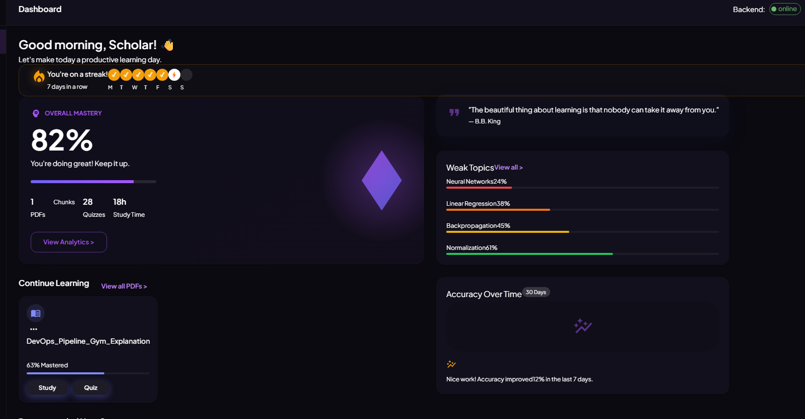
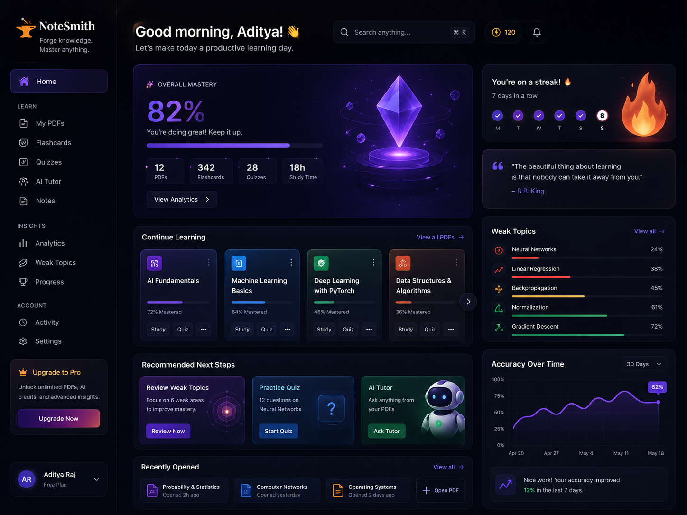
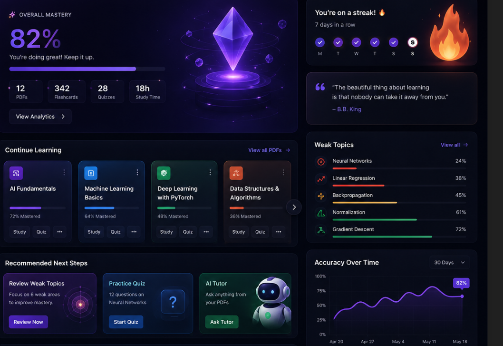

<p align="center">
  
</p>

<h1 align="center">📝 NoteSmith</h1>
<p align="center">
  <b>Your AI Study Copilot — Turn PDFs into Mastery</b>
</p>

<p align="center">
  
  
  
  
  
  
  
  
</p>

<p align="center">
  
</p>

---

## ✨ What is NoteSmith?

**NoteSmith** is an AI-powered study companion that transforms your PDF notes, textbooks, and question papers into an **interactive learning experience**.

Upload any PDF → It gets chunked, embedded, and indexed into a vector database → Then you can:

| 🧠 Feature | ⚡ What it Does |
|---|---|
| **Summarize** | Condense chapters into short/medium/long summaries |
| **Q&A** | Ask questions & get answers grounded in your PDFs |
| **Questions** | Generate 2/5/10-mark exam-style questions |
| **Flashcards** | AI-generated front/back cards for active recall |
| **Quiz** | Multiple-choice quizzes with adjustable difficulty |
| **AI Tutor** | Explain any concept at 6 levels (kid → interview) |
| **Paper Analyzer** | Spot topic trends & predict exam questions |
| **Mastery Tracking** | Weighted score across quiz, flashcard & tutor events |
| **Study Loop** | Spaced repetition with weak-topic detection |
| **Weekly Intel** | Personalized study recommendations |
| **Reports** | Generate & download mastery reports |

---

## 🎯 Demo

> ⚡ **Try it yourself in under 2 minutes:**

```
┌─────────────────────────────────────────────────────────┐
│  1. Upload a PDF     ──►  2. Generate Summary          │
│  3. Ask Questions    ──►  4. Create Flashcards          │
│  5. Take a Quiz      ──►  6. Track Your Mastery         │
│  7. Analyze Papers   ──►  8. Predict Exam Questions     │
└─────────────────────────────────────────────────────────┘
```

### 📸 Screenshots

| Dashboard | Upload & Library |
|---|---|
|  |  |

| Q&A with Streaming | Flashcards |
|---|---|
|  |  |

| Theme System | Paper Analyzer |
|---|---|
|  |  |

---

## 🏗️ Architecture

```
┌─────────────────────────────────────────────────────────────┐
│                    FRONTEND (React 19)                       │
│  ┌───────────┐  ┌──────────┐  ┌───────────┐  ┌───────────┐ │
│  │ Dashboard │  │  Upload  │  │  Q&A      │  │  Quiz     │ │
│  │  (Stats)  │  │  (PDFs)  │  │  (Stream) │  │  (MCQ)    │ │
│  └───────────┘  └──────────┘  └───────────┘  └───────────┘ │
│  ┌───────────┐  ┌──────────┐  ┌───────────┐  ┌───────────┐ │
│  │ Flashcards│  │  Tutor   │  │  Paper    │  │  Study    │ │
│  │           │  │  (6 lvls)│  │  Analyzer │  │  Loop     │ │
│  └───────────┘  └──────────┘  └───────────┘  └───────────┘ │
└──────────────────────┬──────────────────────────────────────┘
                       │  REST + SSE (Streaming)
┌──────────────────────▼──────────────────────────────────────┐
│                   BACKEND (FastAPI)                          │
│  ┌──────────┐  ┌──────────┐  ┌───────────┐  ┌────────────┐ │
│  │  PDF     │  │  RAG     │  │  Mastery  │  │  Learning  │ │
│  │  Routes  │  │  Pipeline│  │  Tracking │  │  Loop      │ │
│  └──────────┘  └──────────┘  └───────────┘  └────────────┘ │
│  ┌──────────┐  ┌──────────┐  ┌───────────┐                 │
│  │  LLM    │  │  Vector  │  │  Chunker  │                 │
│  │  Client │  │  Store   │  │           │                 │
│  └──────────┘  └──────────┘  └───────────┘                 │
└──────┬──────────────────────┬───────────────────────────────┘
       │                      │
┌──────▼──────┐    ┌─────────▼──────────┐
│  Ollama     │    │  SQLite + ChromaDB  │
│  gemma4:12b │    │  + Supabase (opt.)  │
│  nomic-embed│    │                     │
└─────────────┘    └─────────────────────┘
```

---

## 🚀 Quick Start

### Prerequisites

- **Python 3.10+**
- **Node.js 18+**
- **Ollama** (with `gemma4:12b` & `nomic-embed-text` pulled)
- *(Optional)* **Supabase** account for Study Loop history

### Setup

```bash
# 1. Clone & enter
git clone https://github.com/gajanand27-05/NoteSmith.git
cd NoteSmith

# 2. Run the setup script
setup.bat
# └── Creates venv, installs Python deps, runs npm install
# └── Copies .env.example → .env

# 3. Edit .env if needed
#    - OLLAMA_BASE_URL, OLLAMA_CHAT_MODEL, OLLAMA_EMBED_MODEL
#    - Optional: SUPABASE_URL, SUPABASE_ANON_KEY, SUPABASE_SERVICE_ROLE_KEY

# 4. Start everything!
run_all.bat
# └── Backend  → http://localhost:8000
# └── Frontend → http://localhost:3000
```

### Manual Start

```bash
# Terminal 1: Backend
call venv\Scripts\activate
uvicorn app.main:app --reload --host 0.0.0.0 --port 8000 --app-dir backend

# Terminal 2: Frontend
cd frontend && npm run dev

# Terminal 3: Ollama (must be running)
ollama serve
```

> 🌐 **API Docs** at [http://localhost:8000/docs](http://localhost:8000/docs)

---

## 🧩 Features Deep Dive

### 📄 PDF Upload & Processing
- Drag-and-drop upload with real-time progress bar
- Automatic chunking (1000 chars, 200 overlap)
- Embedding via `nomic-embed-text` → ChromaDB vector store
- Processing pipeline: `uploaded → chunking → embedding → indexing`

### 💬 Q&A with RAG
- Retrieval-Augmented Generation over your PDFs
- Server-Sent Events (SSE) for real-time streaming answers
- Source citations with distance scores
- Automatic mastery tracking on each question

### 🧠 AI Tutor
- 6 depth levels: Kid → School → High School → College → Engineering → Interview
- Context-aware answers using PDF content
- Follow-up suggestions & "Explain Simpler" button
- Integration with Flashcard & Quiz pages

### 📊 Mastery Engine
| Event Type | Weight |
|---|---|
| Quiz | 45% |
| Flashcard | 30% |
| Study Session | 10% |
| Tutor Session | 10% |
| Q&A | 5% |
| Paper Analyzer | 5% |

- Time-decay weighting (recent events matter more)
- Topic-level & document-level scores
- Trend detection (improving / declining / stable)
- Weak-topic identification for targeted revision

### 📈 Paper Analyzer
- Upload 2+ previous year question papers
- AI extracts questions, topics, marks
- Normalizes topic names across papers
- Computes frequency & trend (rising / falling / stable)
- **Predicts** likely exam questions with confidence scores
- Perfect for exam prep strategy

### 🔁 Study Loop
- Spaced repetition via quiz & flashcard reviews
- Automatic weak-topic detection
- Study streak tracking (current & best)
- Activity log across all study modes
- Weekly intelligence report

---

## 🧪 Testing

```bash
# Activate venv first
call venv\Scripts\activate

# Run all tests
pytest

# Run with coverage
pytest --cov=backend/app

# Run specific test
pytest tests/test_question_gen.py -v
```

17 test suites covering:
- PDF processing & chunking
- Question & flashcard generation
- Quiz generation
- Paper analysis
- Dashboard & route endpoints
- Learning loop & mastery tracking
- Database operations

---

## 🛠️ Tech Stack

| Layer | Technology |
|---|---|
| **Frontend** | React 19, Vite 8, Material UI 9, React Router 7 |
| **Backend** | FastAPI 0.110, Pydantic 2, Uvicorn |
| **AI/LLM** | Ollama (gemma4:12b), Google Gemini 2.5 Flash (optional) |
| **Embeddings** | nomic-embed-text via Ollama |
| **Vector DB** | ChromaDB (PersistentClient, cosine space) |
| **Database** | SQLite (mastery tracking) + Supabase/Postgres (study loop history) |
| **PDF** | PyPDF |
| **Streaming** | SSE (Server-Sent Events) for real-time Q&A |

---

## 🎨 UI Highlights

- 🌗 **Dark/Light mode** with smooth transition
- 🪟 **Glassmorphism** cards & blurred backdrops
- ⌨️ **Command palette** (`Ctrl+K`) — navigate anywhere
- 🔑 **Keyboard shortcuts** — `G D` → Dashboard, `G U` → Upload, `G Q` → Questions, `?` → Help
- 📱 **Responsive** — works on mobile, tablet, desktop
- 🎥 **Animated backgrounds** — crystal loop video on dashboard

---

## 🤝 Contributing

1. Fork the repo
2. Create your feature branch (`git checkout -b feature/amazing`)
3. Commit your changes (`git commit -m 'Add amazing feature'`)
4. Push (`git push origin feature/amazing`)
5. Open a Pull Request

---

## 👤 Author

**Gajanand Dhayagode**

- GitHub: [@gajanand27-05](https://github.com/gajanand27-05)
- Email: gajanandvd2005@gmail.com

---

## 📜 License

MIT © 2026 Gajanand Dhayagode

---

<p align="center">
  
  <br/>
  <b>Made with ❤️ for students who dream big</b>
</p>
