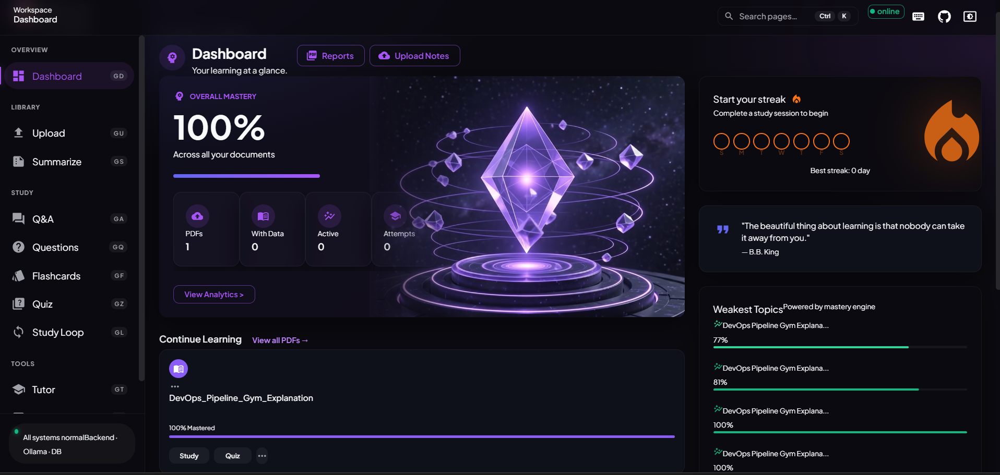

<div align="center">
  
  <br/><br/>
  <h1>📝 NoteSmith</h1>
  <p><strong>Your AI Study Copilot — Turn PDFs into Mastery</strong></p>

  <a href="#🚀-quick-start"></a>
  <a href="#🧠-features"></a>
  <a href="#🏗️-architecture"></a>
  <a href="#🧪-testing"></a>

  <br/><br/>

  <div>
    
    
    
    
    
    
    
    
    
  </div>

  <br/>

  
</div>

<br/>

---

<div align="center">
  <h2>🔥 The Problem</h2>
  <p><strong>Textbooks are heavy. Notes pile up. Exam prep is overwhelming.</strong></p>
  <p>You spend hours reading, but <em>retention</em> is the real battle. What if AI did the heavy lifting?</p>

  <h2>💡 The Solution</h2>
  <p><strong>NoteSmith — upload your PDFs and instantly get summaries, Q&A, flashcards, quizzes,<br/>
  an AI tutor, exam predictions, and a smart mastery tracker that knows what you're weak at.</strong></p>
</div>

---

## ⚡ One-Liner

> Upload any PDF → AI reads, chunks, and indexes it → You get a full interactive study suite with RAG-powered Q&A, spaced repetition, mastery tracking, and exam prediction.

---

## 🎮 Features at a Glance

<div align="center">

| ⚡ Feature | 🎯 What It Does | 🔥 Why You'll Love It |
|---|---|---|
| **📄 Upload & Index** | Drag-drop PDF → chunked → embedded → vector DB | Auto-processing with live status |
| **📝 Summarize** | AI condenses chapters (short/medium/long) | Save hours of reading |
| **💬 Q&A** | Ask anything, get answers from your PDFs | RAG-powered with source citations |
| **📋 Questions** | Generate 2/5/10-mark exam questions | Practice like the real exam |
| **🃏 Flashcards** | AI creates front/back cards | Active recall on autopilot |
| **📊 Quiz** | Multiple-choice at 3 difficulty levels | Test yourself anywhere |
| **🧠 AI Tutor** | Explain concepts at 6 levels (kid → interview) | Learn at YOUR pace |
| **📈 Paper Analyzer** | Upload past papers → extracts topics → predicts questions | Ace your exams |
| **🎯 Mastery Engine** | Weighted score across all activities | Know exactly what you suck at |
| **🔄 Study Loop** | Spaced repetition + weak topic detection | Never forget again |
| **📬 Weekly Intel** | Activity heatmap + growth stats | Track your progress |
| **📑 Reports** | Generate mastery & weekly reports | Proof of your improvement |

</div>

---

## ⚙️ System Flow

```
                            ┌──────────────┐
                            │   📤 USER    │
                            │  Uploads PDF │
                            └──────┬───────┘
                                   │
                            ┌──────▼───────┐
                            │   📖 PyPDF   │
                            │  Extract     │
                            │  Text        │
                            └──────┬───────┘
                                   │
                    ┌──────────────┴──────────────┐
                    │                             │
             ┌──────▼──────┐             ┌───────▼────────┐
             │  ✂️ Chunker  │             │  📊 Status DB  │
             │ (1000/200)  │             │  (SQLite)      │
             └──────┬──────┘             └───────┬────────┘
                    │                            │
             ┌──────▼──────┐                     │
             │  🧮 nomic-  │                     │
             │  embed-text │                     │
             └──────┬──────┘                     │
                    │                            │
             ┌──────▼──────────┐                 │
             │  🗄️ ChromaDB    │                 │
             │  Vector Store   │                 │
             │  (cosine space) │                 │
             └──────┬──────────┘                 │
                    │                            │
                    └──────────┬─────────────────┘
                               │
                    ┌──────────▼──────────┐
                    │   👤 USER INTERACTS │
                    │   (React Frontend)  │
                    └──────────┬──────────┘
                               │
            ┌──────────────────┴──────────────────┐
            │                                     │
     ┌──────▼────────┐                  ┌─────────▼────────┐
     │  🔍 RAG Query │                  │  📚 Other Tasks   │
     │  (retrieve    │                  │  Summarize        │
     │   + LLM)      │                  │  Quiz Generation  │
     └──────┬────────┘                  │  Flashcard Gen    │
            │                           │  Tutor Explain    │
            │                           │  Paper Analyzer   │
            │                           │  Mastery Compute  │
            │                           └─────────┬────────┘
            │                                     │
            └────────────────┬────────────────────┘
                             │
                    ┌────────▼────────┐
                    │  🤖 LLM CORE   │
                    │                 │
                    │  ┌───────────┐  │
                     │  │  🌐 OpenRouter │  │  ← Try first
                     │  │  gpt-oss-120b  │  │
                     │  └──────┬───────┘  │
                     │         │ fail     │
                     │  ┌──────▼───────┐  │
                     │  │  🦙 Ollama   │  │  ← Fallback
                     │  │  gemma4:12b  │  │
                     │  └──────────────┘  │
                    └────────┬────────┘
                             │
                    ┌────────▼────────┐
                    │  ✅ RESPONSE   │
                    │  to User       │
                    └─────────────────┘
```

---

## 🏗️ Architecture

```
┌────────────────────────────────────────────────────────────────────────────────────┐
│                             🌐 FRONTEND (React 19 + Vite)                           │
│                                                                                      │
│  ┌─────────────┐  ┌───────────┐  ┌───────────┐  ┌───────────┐  ┌───────────────┐  │
│  │  Dashboard  │  │  Upload   │  │  Q&A      │  │  Quiz     │  │  Flashcards   │  │
│  │  Streaks    │  │  DragDrop  │  │  SSE      │  │  MCQ      │  │  Active       │  │
│  │  Mastery    │  │  Progress │  │  Stream   │  │  Engine   │  │  Recall       │  │
│  └─────────────┘  └───────────┘  └───────────┘  └───────────┘  └───────────────┘  │
│  ┌─────────────┐  ┌───────────┐  ┌───────────┐  ┌───────────┐                     │
│  │  AI Tutor   │  │  Paper    │  │  Study    │  │  Reports  │                     │
│  │  6 Levels   │  │  Analyzer │  │  Loop     │  │  Mastery  │                     │
│  │  Follow-ups │  │  Predict  │  │  Spaced   │  │  Weekly   │                     │
│  └─────────────┘  └───────────┘  └───────────┘  └───────────┘                     │
│                                                                                      │
│  ┌──────────────────────────────────────────────────────────────────────────────┐  │
│  │  Shared Layer: MUI v9 Theme (🌙/☀️), Command Palette (Ctrl+K), Axios,       │  │
│  │  React Router v7, Keyboard Shortcuts (G D, G U, G Q...), Error Boundaries  │  │
│  └──────────────────────────────────────────────────────────────────────────────┘  │
└────────────────────────────────┬───────────────────────────────────────────────────┘
                                 │  REST + SSE (streaming)
                                 │
┌────────────────────────────────▼───────────────────────────────────────────────────┐
│                            ⚙️ BACKEND (FastAPI + Uvicorn)                           │
│                                                                                      │
│  ┌──────────────────────────────────────────────────────────────────────────────┐  │
│  │                              API ROUTES                                      │  │
│  │  /api/pdfs  /api/qa  /api/quiz  /api/flashcards  /api/questions              │  │
│  │  /api/tutor /api/papers /api/mastery /api/loop /api/intel                    │  │
│  │  /api/summarize /api/reports /api/study-plan /api/dashboard                  │  │
│  └──────────────────────────────────────────────────────────────────────────────┘  │
│                                                                                      │
│  ┌────────────────────────────┬──────────────────────────┬──────────────────────┐  │
│  │        SERVICES            │         CORE             │        DB            │  │
│  │                           │                          │                      │  │
 │  │  summarizer.py            │  llm.py (OpenRouter→Ollama)│  database.py         │  │
│  │  quiz_gen.py              │  chunker.py              │  (SQLite)            │  │
│  │  flashcard_gen.py         │  embeddings.py           │                      │  │
│  │  question_gen.py          │  pdf_processor.py        │  supabase.py         │  │
│  │  paper_analyzer.py        │  vector_store.py         │  (PostgreSQL opt.)   │  │
│  │  mastery.py               │  retriever.py            │                      │  │
│  │  learning_loop.py         │  rag_pipeline.py         │                      │  │
│  │  dashboard.py             │                          │                      │  │
│  │  weekly_intel.py          │                          │                      │  │
│  │  report_gen.py            │                          │                      │  │
│  │  study_plan.py            │                          │                      │  │
│  │  tutor.py                 │                          │                      │  │
│  └────────────────────────────┴──────────────────────────┴──────────────────────┘  │
│                                                                                      │
│  ┌──────────────────────────────────────────────────────────────────────────────┐  │
│  │  Config: pydantic-settings (.env) | Models: Pydantic v2 (BaseModel)         │  │
│  └──────────────────────────────────────────────────────────────────────────────┘  │
└────────┬──────────────────────────────────────────┬─────────────────────────────────┘
         │                                          │
         │                                          │
┌────────▼────────────────┐    ┌───────────────────▼──────────────────┐
│    🤖 AI LAYER          │    │      💾 STORAGE LAYER               │
│                         │    │                                      │
│  ┌────────────────────┐  │    │  ┌───────────────────────────────┐  │
│  │  🌐 OpenRouter     │  │    │  │  SQLite (notesmith.db)       │  │
│  │  (gpt-oss-120b)    │  │    │  │  ├─ pdfs table               │  │
│  │  ↓ fallback →      │  │    │  │  ├─ mastery_events table     │  │
│  │  🦙 Ollama Local   │  │    │  │  └─ mastery_scores table     │  │
│  │  (gemma4:12b)      │  │    │  └───────────────────────────────┘  │
│  │  (nomic-embed-text)│  │    │                                      │
│  └────────────────────┘  │    │  ┌───────────────────────────────┐  │
│                         │    │  │  ChromaDB (PersistentClient)  │  │
│                         │    │  │  ├─ Cosine similarity space   │  │
│                         │    │  │  └─ HNSW indexing             │  │
│                         │    │  └───────────────────────────────┘  │
│                         │    │                                      │
│                         │    │  ┌───────────────────────────────┐  │
│                         │    │  │  Supabase (optional)          │  │
│                         │    │  │  ├─ quiz_attempts table       │  │
│                         │    │  │  ├─ flashcard_reviews table   │  │
│                         │    │  │  └─ tutor_sessions table      │  │
│                         │    │  └───────────────────────────────┘  │
└─────────────────────────┘    └──────────────────────────────────────┘
```

---

## 🚀 Quick Start

<details>
<summary><strong>🪟 Windows — One-Click Setup</strong></summary>

```bat
# 1. Clone
git clone https://github.com/gajanand27-05/NoteSmith.git
cd NoteSmith

# 2. Run setup (creates venv, installs deps, npm install, copies .env)
setup.bat

# 3. Make sure Ollama is running with models pulled
ollama serve
ollama pull gemma4:12b
ollama pull nomic-embed-text

# 4. Start everything
run_all.bat
# Backend → http://localhost:8000
# Frontend → http://localhost:3000
```
</details>

<details>
<summary><strong>🐧 Linux / macOS — Manual Setup</strong></summary>

```bash
# 1. Clone
git clone https://github.com/gajanand27-05/NoteSmith.git
cd NoteSmith

# 2. Python backend
python3 -m venv venv
source venv/bin/activate
pip install -r requirements.txt

# 3. Frontend
cd frontend && npm install && cd ..

# 4. Environment
cp .env.example .env
# Edit .env if needed

# 5. Start Ollama
ollama serve
ollama pull gemma4:12b
ollama pull nomic-embed-text

# 6. Run (two terminals)
# Terminal 1:
uvicorn app.main:app --reload --host 0.0.0.0 --port 8000 --app-dir backend
# Terminal 2:
cd frontend && npm run dev
```
</details>

> 🌐 **API Docs:** [http://localhost:8000/docs](http://localhost:8000/docs)

---

## 🧠 Features Deep Dive

### 📄 PDF Upload & Processing Pipeline

```
┌──────────┐    ┌──────────┐    ┌──────────┐    ┌──────────┐    ┌──────────┐
│ Uploaded │──► │ Chunking │──► │Embedding │──► │ Indexing │──► │  Done!   │
│  (file)  │    │ (1000ch) │    │ (nomic)  │    │(ChromaDB)│    │  ✅      │
└──────────┘    └──────────┘    └──────────┘    └──────────┘    └──────────┘
```

- 🎯 **Drag & drop** or click to upload — 50MB max
- ⏱️ **Real-time progress** bar + processing step indicator
- ✂️ **Chunker** splits text at sentence boundaries (1000 chars, 200 overlap)
- 🧮 **nomic-embed-text** generates 768-dimension embeddings
- 🗄️ **ChromaDB** stores vectors with cosine distance + HNSW indexing
- 🔄 **Auto-polling** frontend shows "uploaded → chunking → embedding → indexing"

---

### 💬 Q&A with RAG (Retrieval-Augmented Generation)

```
  ┌─────────────┐
  │ "What is X?" │
  └──────┬──────┘
         │
  ┌──────▼──────┐
  │  🔍 Retriever│  ← ChromaDB cosine search (top-k=5)
  │  embed query │
  └──────┬──────┘
         │ returns 5 most relevant chunks
  ┌──────▼──────┐
  │  📝 LLM     │  ← OpenRouter → Ollama fallback
  │  Generate   │  ← System: "Answer using ONLY these notes"
  └──────┬──────┘
         │ SSE stream (token by token)
  ┌──────▼──────┐
  │  ✅ Answer  │  + source citations with distance scores
  │  + Sources  │  + mastery event recorded
  └─────────────┘
```

- ⚡ **SSE streaming** — tokens arrive in real-time (not waiting for full response)
- 📎 **Source citations** — each answer shows which chunks it came from
- 🎯 **Mastery integration** — every Q&A updates your mastery score
- 🤖 **Auto-fallback** — OpenRouter first, Ollama if unavailable

---

### 🧠 AI Tutor — 6 Levels of Depth

```
                🧒 Kid        "Explain like I'm 5"
                🏫 School     "Simple terms please"
                📚 High School "I'm studying for finals"
                🎓 College     "Give me the full picture"
                🔧 Engineering "Technical deep-dive"
                💼 Interview   "Make me job-ready"
```

- 🔗 **Context-aware** — optionally use a PDF's content for grounded answers
- 🔄 **Follow-up suggestions** — AI generates related questions to explore
- ➡️ **"Explain Simpler"** — drops one difficulty level
- 💡 **"Give Example"** — generates a new example on demand
- 🎮 **One-click** → navigate to Quiz or Flashcards for the same topic

---

### 📊 Mastery Engine — Know What You Don't Know

```
EVENT                    WEIGHT    WHY IT MATTERS
────────────────────────────────────────────────────
📝 Quiz                  45%       Direct knowledge assessment
🃏 Flashcard             30%       Active recall signal
📖 Study Session         10%       General engagement
🗣️  Tutor Session         10%       Conceptual understanding
💬 Q&A                    5%       Curiosity-driven learning
📈 Paper Analyzer         5%       Exam prep intensity
────────────────────────────────────────────────────

TIME DECAY:  <7 days = 100%  |  7-30 days = 80%  |  30-90 days = 50%  |  >90 days = 20%
```

- 🎯 **Weighted scoring** — quizzes matter most, but everything counts
- 📉 **Time decay** — recent activity weights more (forgetting curve!)
- 📈 **Trend detection** — improving / declining / stable per document
- 🆘 **Weak topic identification** — finds what needs revision
- 💡 **Smart recommendations** — "Your mastery is low, try a quiz!"

---

### 📈 Paper Analyzer — Predict Your Exam

```
Upload 2+ past question papers
              │
              ▼
      ┌──────────────┐
      │ AI Extracts  │  → Q1. What is POS tagging? MARKS: 5 TOPIC: NLP
      │ per paper    │  → Q2. Explain backprop... MARKS: 10 TOPIC: ML
      └──────┬───────┘
             │
      ┌──────▼───────┐
      │ Normalize    │  → "POS Tagging" = "Part-of-Speech Tagging" = "POS"
      │ Topic Names  │
      └──────┬───────┘
             │
      ┌──────▼───────┐
      │ Compute      │  → NLP: 12 times (rising 📈)
      │ Frequencies  │  → ML: 8 times (stable ➡️)
      │ & Trends     │  → DBMS: 3 times (falling 📉)
      └──────┬───────┘
             │
      ┌──────▼───────┐
      │ PREDICT      │  → P1. [NLP] What is HMM? (conf: 0.92)
      │ Exam         │  → P2. [ML] Explain gradient descent (conf: 0.85)
      │ Questions!   │  → P3. [NLP] Difference between POS and parsing (conf: 0.78)
      └──────────────┘
```

---

### 🔄 Study Loop — Spaced Repetition on Autopilot

- 📊 **Tracks** quiz attempts, flashcard reviews, and tutor sessions
- 🧮 **Weighted accuracy** — quiz (1.0×), flashcard (0.6×), tutor (0.3×)
- 🎯 **Per-topic weakness** — identifies exactly which topics need revision
- 📅 **Study streak** — current + best streak, day-of-week heatmap
- ⏰ **Neglected topic detection** — finds topics you haven't reviewed in days
- 📬 **Weekly Intel** — activity summary, growth stats, heatmap

---

## 🧪 Testing

```bash
# Activate virtual environment
call venv\Scripts\activate   # Windows
source venv/bin/activate     # Linux/macOS

# Run all 17 test suites
pytest -v

# With coverage report
pytest --cov=backend/app --cov-report=term-missing

# Specific test file
pytest tests/test_question_gen.py -v
```

**What's tested:**

| Test Suite | What It Covers |
|---|---|
| `test_pdf_processor.py` | Text extraction, page counting |
| `test_chunker.py` | Chunk splitting, overlap handling |
| `test_question_gen.py` | 2/5/10-mark question generation |
| `test_flashcard_gen.py` | Flashcard front/back generation |
| `test_quiz_gen.py` | MCQ generation with options |
| `test_paper_analyzer.py` | Question extraction, topic prediction |
| `test_learning_loop.py` | Mastery computation, streak tracking |
| `test_dashboard.py` | Dashboard stats, trend classification |
| `test_database.py` | SQLite CRUD, migrations |
| `test_schemas.py` | Pydantic validation |
| `test_routes.py` | API endpoint responses |
| `test_tutor.py` | Tutor explanation generation |
| `test_summarize.py` | Summary generation |
| `test_loop_routes.py` | Study loop API endpoints |
| `test_dashboard_routes.py` | Dashboard API endpoints |

---

## 🛠️ Tech Stack Deep Dive

| Layer | Tech | What It Does |
|---|---|---|
| **🎨 Frontend** | React 19 + Vite 8 | Blazing fast dev server, HMR, optimized builds |
| **🎭 UI** | MUI 9 (Material-UI) | Glassmorphism, dark/light theme, responsive grid |
| **📡 HTTP** | Axios | API calls with upload progress callbacks |
| **🧭 Routing** | React Router 7 | Nested layouts, error boundaries per route |
| **⌨️ UX** | Command Palette + Keyboard shortcuts | Ctrl+K to navigate, G+letter for instant page jumps |
| **⚙️ Backend** | FastAPI 0.110 + Uvicorn | Async Python REST API with auto-generated OpenAPI docs |
| **✅ Validation** | Pydantic v2 | Request/response schemas with strict typing |
| **🤖 Primary AI** | Ollama — gemma4:12b | Local LLM, no data leaves your machine |
| **☁️ Cloud AI** | OpenRouter (gpt-oss-120b) | Auto-fallback when Ollama unavailable |
| **🧮 Embeddings** | nomic-embed-text (via Ollama) | 768-dim vectors for semantic search |
| **🗄️ Vector DB** | ChromaDB (PersistentClient) | Cosine similarity, HNSW indexing, persistent on disk |
| **💾 DB** | SQLite | Mastery tracking, PDF metadata, event store |
| **☁️ Cloud DB** | Supabase (PostgreSQL) | Optional: study loop history with time-series queries |
| **📄 PDF** | PyPDF | Text extraction from PDFs |
| **⚡ Streaming** | SSE (Server-Sent Events) | Real-time token-by-token Q&A responses |
| **🎬 Media** | Three.js + @react-three/fiber | 3D animated crystal loop on dashboard |

---

## 🎨 UI/UX Highlights

```
                          ╭──────────────────╮
                          │  🌗 Theme Toggle │
                          ╰──────────────────╯
    ╭──────────╮     ╭──────────────────────────────╮
    │  Sidebar │     │       Main Content            │
    │          │     │                               │
    │  📊 Dash │     │  ┌─────────────────────────┐  │
    │  📤 Upload│     │  │  Hero Card: Mastery     │  │
    │  📝 Summ. │     │  │  82% ████████████░░░    │  │
    │  💬 Q&A   │     │  └─────────────────────────┘  │
    │  📋 Qs    │     │  ┌──────┐ ┌──────┐ ┌──────┐ │
    │  🃏 Cards │     │  │PDF 1 │ │PDF 2 │ │PDF 3 │ │
    │  📊 Quiz  │     │  │72%   │ │45%   │ │91%   │ │
    │  🧠 Tutor │     │  └──────┘ └──────┘ └──────┘ │
    │  📈 Papers│     │  ┌─────────────────────────┐ │
    │  🔄 Loop │     │  │  Recommended Next        │ │
    │  📑 Rpt   │     │  └─────────────────────────┘ │
    ╰──────────╯     ╰──────────────────────────────╯
```

- 🌗 **Dark/Light mode** — system-aware with smooth glassmorphism transitions
- 🪟 **Glass cards** — semi-transparent with backdrop blur
- ⌨️ **Command Palette** (`Ctrl+K`) — search & navigate any page
- 🔑 **Keyboard shortcuts** — `G+D` Dashboard, `G+U` Upload, `G+Q` Questions, `?` Help
- 📱 **Fully responsive** — mobile sidebar drawer, adaptive grids
- 🎥 **3D crystal loop** — animated hero background on dashboard
- 🔥 **Orange streak circles** — Sun-Sat day tracker with glow effects

---

## 📁 Project Structure

```
NoteSmith/
├── backend/
│   └── app/
│       ├── api/routes/      # 15 FastAPI routers (health, pdfs, qa, quiz...)
│       ├── core/             # LLM, chunker, embeddings, vector store, RAG
│       ├── db/               # SQLite + Supabase clients
│       ├── models/           # Pydantic schemas
│       └── services/         # Business logic (12 services)
├── frontend/
│   ├── public/               # Static assets, 3D logo, crystal video
│   └── src/
│       ├── components/       # Shared: Sidebar, TopBar, Layout, CommandPalette
│       ├── pages/            # 11 page components
│       └── assets/           # Hero image, icons
├── data/                     # Uploads + ChromaDB persistence
├── tests/                    # 17 pytest test suites
├── resources/                # README images, screenshots
├── setup.bat                 # One-click setup
├── run_all.bat               # One-click launch
└── .env.example              # Environment template
```

---

## 👤 Author

<div align="center">
  <strong>Gajanand Dhayagode</strong>
  <br/>
  <a href="https://github.com/gajanand27-05">🐙 @gajanand27-05</a>
  &nbsp;•&nbsp;
  <a href="mailto:gajanandvd2005@gmail.com">✉️ gajanandvd2005@gmail.com</a>
</div>

---

## 📜 License

<div align="center">
  <strong>MIT © 2026 Gajanand Dhayagode</strong>
  <br/><br/>
  
  <br/>
  <strong>Made with ❤️, ☕, and 🤖 for students who dream big</strong>
</div>
